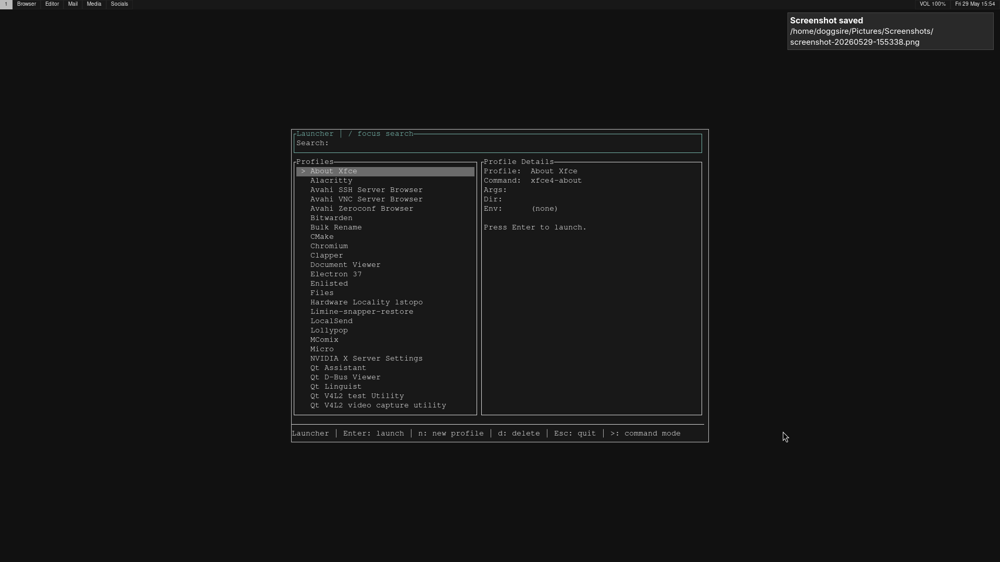

# obtuiner

Development note: AI tools were used during the creation of this app.

## Why obtuiner?

A few projects got really close to what I wanted — [rofi](https://github.com/davatorium/rofi), [walker](https://github.com/abenz1267/walker), and [pacseek](https://github.com/moson-mo/pacseek) are all great, but each one solved a different piece of the puzzle without covering the whole thing. I wanted a launcher *and* a package manager *and* an updater, all in one place and all in the same style.

The reason it's a TUI comes down to portability. The terminal app runs the same whether you're on Wayland, X11, or a plain TTY — no compositor-specific hacks, no display server assumptions, just works. And since it shells out to the package managers already running on your system, there's no need for a lot of complexity under the hood. Adding support for a new distro basically just means knowing what commands it uses.

## Example keybind configuration

**How I use it:** I have two keybindings in my window manager — one that opens a terminal and drops straight into `obtuiner launcher`, and one that opens a terminal and runs `obtuiner updater` followed by `obtuiner installer`. It works pretty much the same everywhere I run Linux.

**Hyprland:** The snippet below is from my Hyprland config — use it as a reference and adjust to fit your own setup (terminal app, modifier key, binary path, etc.):

```hyprlang
# Opens a terminal window with the Obtuiner WM_CLASS set, running the obtuiner binary
$obtuiner = $terminal --class=Obtuiner -e obtuiner

# Super+Space  → open the launcher
bind = $mainMod, SPACE, exec, $obtuiner -l
# Super+Alt+Space → run the updater, then open the installer when it finishes
bind = $mainMod ALT, SPACE, exec, sh -c "$obtuiner -u; $obtuiner -i"

windowrule {
    name = obtuiner
    # Target any window whose class is "Obtuiner" (set by --class above)
    match:class = Obtuiner

    float = true        # keep it floating above other windows
    size = 800 600      # fixed size in pixels
    move = 50% 50%      # centre it on the screen
}
```
Or in the new lua syntax

```lua
# Opens a terminal window with the Obtuiner WM_CLASS set, running the obtuiner binary
local menu        = (terminal .. " --class=Obtuiner -e obtuiner")

# Super+Space  → open the launcher
hl.bind(mainMod .. " + space", hl.dsp.exec_cmd(menu .. " -l"))
# Super+Alt+Space → run the updater, then open the installer when it finishes
hl.bind(mainMod .. " + ALT + space", hl.dsp.exec_cmd('sh -c "' .. menu .. ' -u; ' .. menu .. ' -i"'))

hl.window_rule ({
	name = "obtuiner",
	match = {
    	class = "Obtuiner",
	},

		float = true,
		size = { 800, 600 },
		move = { "50%", "50%" },
})
```




---

A Rust workspace that bundles three Linux-focused terminal tools behind one CLI:

- installer: search, install, and uninstall packages
- launcher: manage and launch app profiles; type `>` to search and run PATH commands
- updater: run full-system or per-package updates

The root binary dispatches to one of those built-in tools:

- installer or -i
- launcher or -l
- updater or -u

It also discovers and dispatches to installed plugins, such as the bundled `powermenu`:

- powermenu or -p: shutdown, reboot, sleep, logout

See [Plugins](#plugins) for how plugin discovery works and how to write your own.

## Features

- TUI-based workflows built with crossterm and ratatui
- Automatic package manager detection
- Supports native managers:
  - pacman (+ optional AUR helper: paru/yay)
  - apt (nala optional)
  - dnf
  - zypper
- Flatpak integration when available
- Dry-run mode for installer/updater command preview
- Launcher profile persistence to JSON
- Launcher command mode: prefix query with `>` to search PATH executables and run them as `>command [args...]`
- External plugin system: any `obtuiner-*` executable on `PATH` (or in the plugins directory) can register itself as a tool
- powermenu plugin: a shutdown/reboot/sleep/logout menu using the same TUI controls as the built-in tools

## Workspace Layout

- obtuiner: top-level CLI entry point, built-in dispatcher, and plugin discovery
- installer: package browser/install/uninstall TUI
- launcher: launch profile manager and app launcher TUI
- updater: update task browser and executor TUI
- powermenu: shutdown/reboot/sleep/logout plugin (built as `obtuiner-powermenu`)
- plugin_api: shared metadata contract used by the root CLI and plugin executables
- runtime_ops: package manager detection and command/query logic
- core_domain: shared models and persistence helpers
- tui_kit: shared TUI rendering and key handling

## Install

### One-liner (recommended)

```bash
curl -fsSL https://raw.githubusercontent.com/doggsire/obtuiner/main/install.sh | sh
```

Or download and inspect before running:

```bash
curl -fsSL https://raw.githubusercontent.com/doggsire/obtuiner/main/install.sh -o install.sh
less install.sh
sh install.sh
```

The script:
- Detects your CPU architecture (x86\_64, aarch64)
- Downloads the prebuilt `obtuiner` binary and `obtuiner-powermenu` plugin (plus SHA256 checksums) from the [latest release](https://github.com/doggsire/obtuiner/releases/latest)
- Verifies checksums before installing
- Installs binaries to a system bin directory (`/usr/bin` or `/usr/local/bin`, depending on availability), or `~/.local/bin`

### Manual binary install

Download the archive for your platform from the [latest release](https://github.com/doggsire/obtuiner/releases/latest), verify the checksum, and copy the binary to your PATH:

```bash
# Example for x86_64
ARCHIVE=obtuiner-vX.Y.Z-x86_64-unknown-linux-gnu.tar.gz
curl -LO "https://github.com/doggsire/obtuiner/releases/latest/download/$ARCHIVE"
curl -LO "https://github.com/doggsire/obtuiner/releases/latest/download/$ARCHIVE.sha256"
sha256sum -c "$ARCHIVE.sha256"
tar -xzf "$ARCHIVE"
sudo mv obtuiner /usr/local/bin/
```

### Build from source

Requires a [Rust toolchain](https://rustup.rs).

```bash
git clone https://github.com/doggsire/obtuiner.git
cd obtuiner
cargo build --release
sudo cp target/release/obtuiner /usr/local/bin/
```

Or install into `~/.cargo/bin` directly:

```bash
cargo install --path obtuiner
```

After install, run from anywhere:

```bash
obtuiner installer
obtuiner launcher
obtuiner updater
```

## Requirements

- Linux environment
- At least one supported package manager installed

Optional but recommended:

- sudo privileges for system package operations
- nala for apt-based systems, if you prefer it over apt
- flatpak for Flatpak install/update support
- paru or yay for AUR support on Arch-based systems

## Run

After installing from source, run through the unified CLI:

```bash
obtuiner installer
obtuiner launcher
obtuiner updater
obtuiner powermenu
```

Short aliases:

```bash
obtuiner -i
obtuiner -l
obtuiner -u
obtuiner -p
```

Dry-run mode (where supported):

```bash
obtuiner installer --dry-run
obtuiner updater --dry-run
```

### Run from source (development)

If you are working from a local clone without installing the binary, use Cargo:

```bash
cargo run -p obtuiner -- installer
cargo run -p obtuiner -- launcher
cargo run -p obtuiner -- updater
```

Short aliases:

```bash
cargo run -p obtuiner -- -i
cargo run -p obtuiner -- -l
cargo run -p obtuiner -- -u
```

Dry-run mode (where supported):

```bash
cargo run -p obtuiner -- installer --dry-run
cargo run -p obtuiner -- updater --dry-run
```

`powermenu` is a plugin rather than a built-in, so running it from source means building it and putting it on `PATH` first — see [Plugins](#plugins).

## Usage Help

If no subcommand is provided, the binary prints usage, plus any discovered plugins:

```text
Usage: obtuiner <installer|launcher|updater|-i|-l|-u> [args...]

Discovered plugins:
  powermenu (-p) - Power menu: shutdown, reboot, sleep, logout
```

## Plugins

Obtuiner supports external plugin executables in addition to its built-in tools. A plugin is any executable whose file name starts with `obtuiner-` (for example `obtuiner-powermenu`), found either on `PATH` or in Obtuiner's plugin directory:

- `~/.local/share/ui/plugins/`

When an unrecognized subcommand is given, the root CLI scans those locations and asks each `obtuiner-*` executable to identify itself by invoking it with a metadata flag:

```bash
obtuiner-powermenu --obtuiner-plugin-metadata
# {"name":"powermenu","aliases":["-p"],"summary":"Power menu: shutdown, reboot, sleep, logout"}
```

A valid plugin responds by printing a single-line JSON document (`name`, `aliases`, `summary`) to stdout and exiting successfully. Once discovered, the plugin is resolved by its `name` or any of its `aliases`, and invoked with the same arguments and stdio as a built-in tool — so it can freely draw its own TUI.

The `plugin_api` crate defines this contract (`PluginMetadata`, the metadata flag, and the `obtuiner-` naming prefix) and provides `handle_metadata_handshake()` for plugin authors to call at the top of `main()`.

### Building and installing the powermenu plugin

If you install via `install.sh`, `obtuiner-powermenu` is installed automatically (when the release contains the plugin artifact).

```bash
cargo build --release -p powermenu
cp target/release/obtuiner-powermenu ~/.local/bin/   # or anywhere on PATH
```

Then run it via the root CLI:

```bash
obtuiner powermenu
obtuiner -p
```

powermenu's four actions (shutdown, reboot, sleep, logout) use `hyprshutdown` when it's available on `PATH` — for a graceful logout, and as the `--post-cmd` step after shutdown/reboot — falling back to direct `systemctl`/`loginctl` commands otherwise. `sleep` always runs `systemctl suspend`.

### Writing your own plugin

1. Build an executable named `obtuiner-<yourtool>`.
2. At the top of `main()`, check for `plugin_api::METADATA_FLAG` and respond with your `PluginMetadata` as JSON (or call `plugin_api::handle_metadata_handshake`).
3. Otherwise, run your tool normally using whatever arguments were passed through.
4. Put the executable on `PATH` or in `~/.local/share/ui/plugins/`.

For a real TUI plugin, `tui_kit` provides the same shared search/results/details layout, key handling, and confirmation modal used by the built-in tools, so a plugin can match Obtuiner's look and controls exactly — see the `powermenu` crate for a complete example.

## Data Storage

Launcher profiles are stored under XDG config paths:

- ~/.config/ui/launcher/profiles.json

If no profiles are present, defaults are generated (for example Terminal and VS Code).

Discovered plugin executables are looked up from:

- ~/.local/share/ui/plugins/ (in addition to `PATH`)

## Tests

Run all workspace tests:

```bash
cargo test --workspace
```

## Notes

- This project is currently Linux-oriented.
- AI tools were used during the creation of this app.
- Command execution depends on tools available on your machine.
- Some package actions may prompt for credentials depending on your sudo configuration.

## License

Copyright 2026 doggsire

Licensed under the [Apache License, Version 2.0](LICENSE). You may not use this project except in compliance with the License. See the [NOTICE](NOTICE) file for attribution details.
